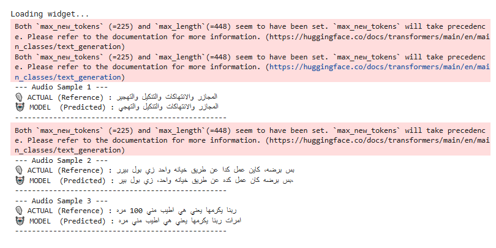
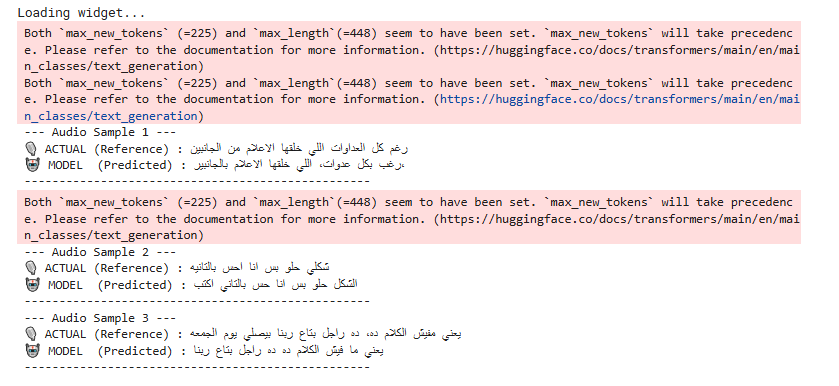

# Evaluation samples

Qualitative output from `stage4_phase2_final` (Phase 2 merged model) on
random held-out test samples, generated with explicit language/task
reminders + beam search:




Generation call used for these:

```python
model.generation_config.language = "arabic"
model.generation_config.task = "transcribe"

predicted_ids = model.generate(
    inputs,
    language="arabic",
    task="transcribe",
    max_new_tokens=225,
    repetition_penalty=1.1,
    num_beams=5,
)
```

## The `max_new_tokens` / `max_length` warning

Both screenshots show this on every generate() call:

> Both `max_new_tokens` (=225) and `max_length` (=448) seem to have been
> set. `max_new_tokens` will take precedence.

Harmless — `max_new_tokens` does win — but noisy. It happens because
Whisper's default `generation_config.max_length=448` is still set on the
model when `max_new_tokens` is also passed at call time. Fixed in
`src/infer.py` by explicitly clearing `generation_config.max_length`
before generating.

## Reading the samples

Five samples across the two screenshots, roughly in order of how close
prediction is to reference:

1. **Sample 1 (img 1)** — near-exact: `والانتهاكات والتكبل والتهجير` vs
   predicted `والانتهاكات والتكبل والتهجي` — one word slightly truncated
   at the very end, otherwise correct.
2. **Sample 2 (img 1)** — mostly correct with local substitutions:
   `عمل كدا` → `عمل كده`, a couple of words shifted (`خياته واحد` vs
   `خياته واحد،`) — meaning intact, minor spelling/punctuation drift.
3. **Sample 3 (img 1)** — a genuine content error: reference starts
   `ربنا يكرمها` (God bless her), prediction starts `امارات ربنا
   يكرمها...` — the model hallucinates an extra word ("Emirates") not
   present in the reference audio.
4. **Sample 1 (img 2)** — reference `رغم كل العداوات اللي خلقها الاعلام
   من الجانبين`, predicted `رغب بكل عدوات اللي خلقها الاعلام بالجانبين`
   — several word-level substitutions (رغم→رغب, عداوات→عدوات) and a
   dropped `من`. Gist survives, exact wording doesn't.
5. **Sample 3 (img 2)** — close but not exact: `يعني مفيش الكلام ده, ده
   راجل بتاع ربنا يصلي يوم الجمعه` vs predicted `يعني ما فيش الكلام ده ده
   راجل بتاع ربنا` — predicted output is truncated, missing the last
   clause (`يصلي يوم الجمعه`).

**Takeaway:** the model gets the gist right consistently, but two
recurring failure modes show up — (a) occasional hallucinated words not
in the source audio (Sample 3, img 1), and (b) truncation cutting off
the tail of longer sentences (Sample 3, img 2). Neither is quantified
yet — this is 5 qualitative examples, not a WER/CER number. Running the
full test-set evaluation (Step 13 in the notebook) would give an actual
error rate instead of eyeballing samples like this.
